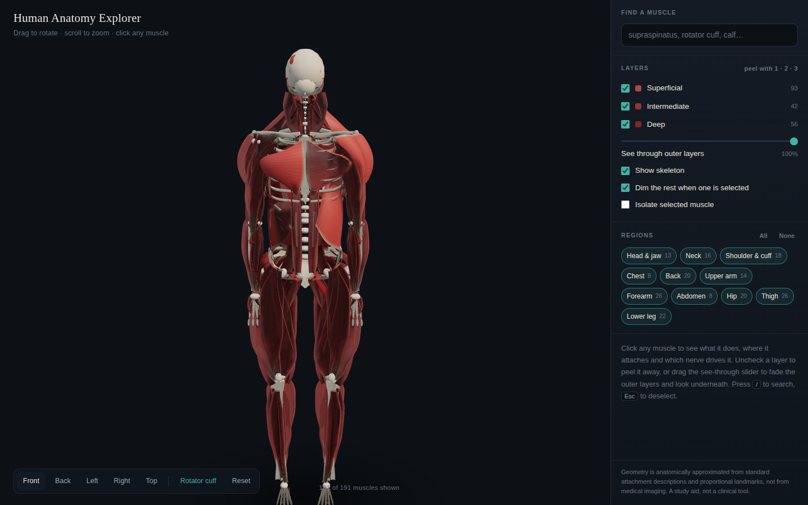

# Human Anatomy Explorer

An interactive 3D model of human musculoskeletal anatomy that runs in a browser.
Rotate the figure, peel away muscle layers, and click any muscle for its action,
attachments, nerve supply and, where relevant, a clinical note.



**Live:** https://amanbaid99.github.io/HumanAnatomy/ (once Pages is switched on, see below)

## What it does

- **191 muscles** across eleven regions, each modelled as real geometry rather than a stick
- **A full skeleton** underneath: curved spine, twelve rib pairs, scapula with its
  spine, acromion and coracoid, and long bones with proper wide ends
- **Peel by layer** (superficial, intermediate, deep) or fade the outer layers with a
  slider to look through them
- **Filter by region**, isolate a single muscle, or search by name, region or function
- **Select anything and see where it connects**: the origin and insertion are marked
  on the body with a line of pull between them, and everything else dims so a deep
  muscle is readable even when three layers sit on top of it
- **A dedicated rotator cuff view** that strips to the deep layer, narrows the skeleton
  to the shoulder girdle, and frames the supraspinatus where it passes under the acromion

## Running it

It is a static site with no build step. Open `index.html` directly, or:

```
npm run serve      # http://localhost:8123
```

Development helpers (need `npm install` first):

```
npm test           # 17 desktop interaction checks + 12 on a phone viewport
npm run shot       # render views headlessly to tools/shots/
```

## Deploying

`.github/workflows/pages.yml` publishes the repo root to GitHub Pages on every
push. It needs Pages turned on once, by hand: the Actions token is not allowed
to create a Pages site that has never existed.

**Settings → Pages → Build and deployment → Source: GitHub Actions.**

Then re-run the workflow (Actions tab → Deploy to GitHub Pages → Re-run jobs),
or just push again. After that every push deploys on its own.

## How the geometry works

There is no scan data here. Every shape is generated at load time from a table of
anatomical landmarks, by two primitives in `src/geometry/loft.js`:

- **`tubeLoft`** sweeps a variable elliptical cross-section along a curved centerline,
  using rotation-minimizing frames so the mesh does not twist. This makes the fusiform
  and strap muscles: biceps, sartorius, the calf.
- **`sheetLoft`** builds a ruled surface between a broad bony origin and a narrow
  insertion, bulges it outward so it drapes over the trunk, and thickens it into a
  solid. This makes the flat fan muscles: trapezius, latissimus dorsi, pectoralis
  major, gluteus maximus.

Both emit a per-vertex `tendon` weight where the muscle narrows, which the material
uses to shade tendon paler and glossier than the belly.

### Occlusion

Separate meshes read as separate objects unless the creases where they meet go dark.
Screen-space AO would cost every frame, which is what a phone cannot spare, and none
of this geometry moves. So `src/geometry/occlusion.js` voxelises the figure at load,
marches a short bundle of rays from every vertex through that grid, and writes the
result into the mesh as an `ao` attribute. About 140 ms once, then free.

It bakes per depth: a deep muscle is occluded by bone and the deep layer only, so
peeling the superficial layer away does not leave what is underneath still wearing a
shadow cast by something no longer on screen.

### Drawing the selection on top

A selected muscle is rendered twice: once in the scene, then again after the depth
buffer is cleared, using a camera layer to pick out just that muscle and its markers.
Without the second pass a deep muscle highlights invisibly under everything else.
Two traps worth knowing if you touch this: `renderer.autoClear` has to be off, and
`scene.background` has to be detached for the overlay pass, because a background that
is a `Color` forces a clear inside `render()` regardless of `autoClear` and silently
wipes the pass before it.

Lighting is image-based, from a gradient environment generated on a canvas and
prefiltered at startup, so there is still no external asset to load.

### Layout

```
index.html                  markup, styling, all the UI
src/app.js                  scene, interaction, state
src/controls.js             orbit / pan / dolly, with time-based damping
src/geometry/loft.js        the two loft primitives
src/geometry/occlusion.js   baked ambient occlusion
src/anatomy/landmarks.js    shared landmark table (one source of truth)
src/anatomy/muscles.js      muscle definitions: attachments, actions, notes
src/anatomy/skeleton.js     bone construction
src/anatomy/build.js        definitions to meshes, and the muscle material
vendor/                     three.js r0.185, vendored so there is no CDN dependency
```

`landmarks.js` is what keeps the model coherent. Bones and muscles both position
themselves against the same named points, so a muscle's origin lands on the bone it
actually comes from instead of near it.

## Accuracy, honestly

The geometry is approximated from standard anatomical attachment descriptions and
proportional landmarks for a 1.80 m adult male figure. It is **not** derived from
medical imaging or a licensed anatomy dataset.

What that means in practice:

- Attachment points, layering order and the relationships between structures are
  reliable. Which muscle lies under which, what runs where, what attaches to what.
- Muscle cross-sections are scaled to real published dimensions, so the proportions
  are close, but the exact contour of any individual belly is an approximation.
- There is no skin, fat, fascia, vasculature or nerve tissue, and no viscera.
- Some regions are rougher than others. The shoulder and rotator cuff got the most
  attention; the hands and feet are the least detailed.

It is a study aid for learning the relationships. It is not a clinical tool and
should not be used for diagnosis.

## Licence

MIT for the code. three.js is MIT, bundled under `vendor/`.
